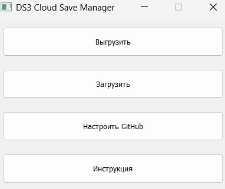

# DS3 Cloud Save Manager

**DS3 Cloud Save Manager** — кроссплатформенная утилита с графическим интерфейсом для резервного копирования и синхронизации сохранений Dark Souls 3 через GitHub.



## Возможности
- Выгрузка и восстановление сохранений DS3 в облако (GitHub) одной кнопкой
- Пошаговый мастер настройки GitHub (создание репозитория, получение токена, проверка)
- Автоматический поиск папки с сохранениями
- Работа без установленного git (только через GitHub API)
- Поддержка Windows, Linux, Mac
- Логирование действий
- Удобный и понятный интерфейс

## Установка и запуск

### 1. Установка зависимостей

```bash
pip install -r requirements.txt
```

### 2. Запуск

```bash
python main.py
```

### 3. Сборка exe для Windows

```bash
pip install pyinstaller
python -m PyInstaller --onefile --windowed main.py
```

Готовый exe-файл появится в папке `dist`.

## Как пользоваться

1. Запустите программу.
2. Нажмите **Настроить GitHub** и следуйте шагам мастера:
    - Создайте приватный репозиторий на GitHub
    - Получите Personal Access Token с правами `repo`
    - Введите ссылку на репозиторий и токен
    - Дождитесь проверки
3. Для резервного копирования нажмите **Выгрузить**
4. Для восстановления — **Загрузить**
5. Все действия сопровождаются уведомлениями и логируются в `log.txt`

## Безопасность
- Токен и ссылка на репозиторий хранятся только локально (файл `.github_creds`)
- `.github_creds` добавлен в `.gitignore` и не попадёт в публичный репозиторий

## FAQ
- **Файл не найден:** Проверьте, что вы запускали игру и у вас есть сохранения
- **Ошибка доступа:** Проверьте правильность токена и ссылки, права доступа к репозиторию
- **Файл пустой после загрузки:** Проверьте размер файла на GitHub, используйте последнюю версию программы

**DS3 Cloud Save Manager** — сделано для удобства игроков Dark Souls 3! 
